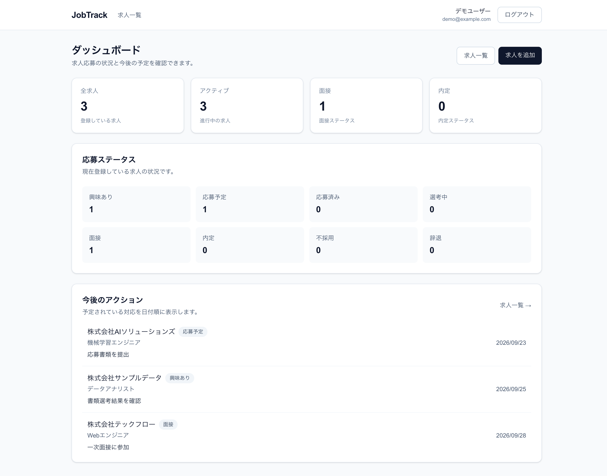
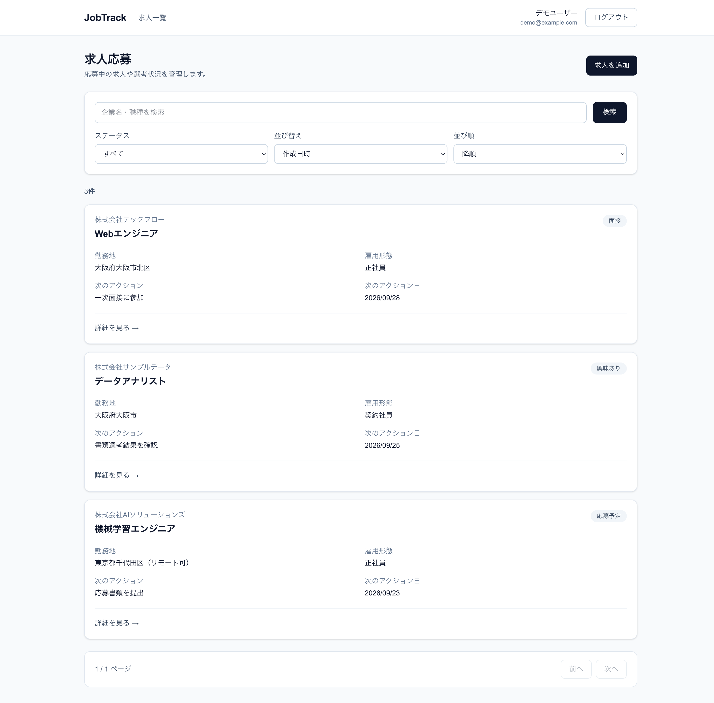
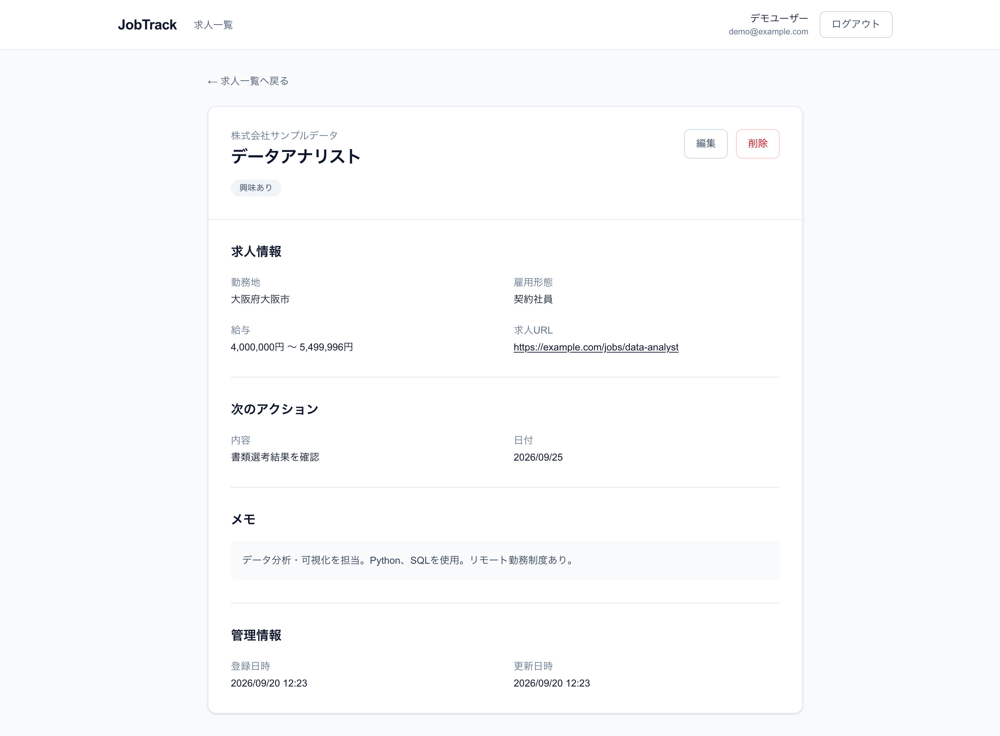

# JobTrack

[](https://github.com/KensukeOta/JobTrack/actions/workflows/backend-ci.yml)
[](https://github.com/KensukeOta/JobTrack/actions/workflows/frontend-ci.yml)
[](https://github.com/KensukeOta/JobTrack/actions/workflows/e2e-ci.yml)

求人への応募状況や選考状況、次に行うアクションを一元管理するWebアプリケーションです。

応募予定から面接・内定までの求人情報を管理し、
就職活動の進捗をダッシュボードで確認できます。

## Demo

**Application**

https://job-track-kensuke.vercel.app

**Backend Health Check**

https://jobtrack-production-e2f1.up.railway.app/health

## Screenshots

### Dashboard



### Job List



### Job Detail



## Features

- ユーザー登録・ログイン・ログアウト
- 求人情報の登録・閲覧・編集・削除
- 求人の検索・ステータス絞り込み
- 並び替え・ページネーション
- 応募状況を確認できるダッシュボード
- ステータス別の求人件数表示
- 今後のアクション・予定の表示
- ユーザーごとの求人データ分離

## Architecture

```text
Browser
  │
  │ HTTPS
  ▼
Vercel
Next.js
  │
  │ /api/v1/*
  │ Next.js Rewrite
  ▼
Railway
FastAPI
  │
  ▼
Railway
PostgreSQL
```

FrontendからBackend APIへの通信は、
Next.js Rewriteを利用してブラウザから見たAPI OriginをFrontendと統一しています。

これにより、HttpOnly Cookieを使用した認証と
CSRF対策を本番環境でも利用できる構成にしています。

## Authentication / Security

認証にはJWTを使用し、アクセストークンは
`HttpOnly Cookie` として保存します。

更新系リクエスト（POST / PATCH / DELETE）には、
signed double-submit方式によるCSRF対策を実装しています。

本番環境では以下のCookie設定を使用しています。

```text
HttpOnly: access_tokenのみ有効
Secure: true
SameSite: Lax
Path: /
```

主なセキュリティ対策：

- JWTによる認証
- Argon2によるパスワードハッシュ
- HttpOnly Cookie
- Secure Cookie
- signed double-submit CSRF
- ユーザー単位のリソース所有権チェック
- CORSの許可Origin制限
- secretsの環境変数管理

## Tech Stack

### Frontend

- Next.js
- React
- TypeScript
- Tailwind CSS

### Backend

- FastAPI
- Python 3.13
- SQLModel
- Alembic
- PostgreSQL
- psycopg

### Testing

- pytest
- Vitest
- React Testing Library
- Playwright

### Infrastructure / CI

- Vercel
- Railway
- Docker
- Docker Compose
- GitHub Actions

## Development

### Requirements

- Node.js 22
- Python 3.13
- uv
- Docker
- Docker Compose

### Environment Variables

`.env.example` をコピーして開発用環境変数を設定します。

```bash
cp .env.example .env
```

secretを含む `.env` はGit管理しません。

### Backend + PostgreSQL

```bash
docker compose up --build
```

Backend:

```text
http://localhost:8000
```

Frontendをローカルで起動する場合：

```bash
cd frontend
npm install
npm run dev
```

Frontend:

```text
http://localhost:3000
```

## Database Migration

Alembicを使用してデータベーススキーマを管理しています。

ローカルでmigrationを適用する場合：

```bash
cd backend
uv run alembic upgrade head
```

本番環境ではRailwayのPre-deploy Commandとして
migrationを実行し、Webアプリケーションの起動処理とは分離しています。

```bash
uv run alembic upgrade head
```

## Testing

JobTrackでは、Backend・Frontend・E2Eの3段階でテストを実施しています。

### Backend

Ruffによる静的解析とpytestによるテストを実行します。

```bash
cd backend
uv run ruff check .
uv run pytest
```

pytestでは107件のテストを実装しています。

### Frontend

ESLint、TypeScriptの型チェック、Vitestによるコンポーネント・UIテストを実行します。

```bash
cd frontend
npm run lint
npm run typecheck
npm test
```

Vitestでは115件のテストを実装しています。

### E2E

Playwrightを使用して、
Frontend・Backend・PostgreSQLを組み合わせた主要ユーザーフローを検証します。

```bash
cd frontend
npm run test:e2e:full
```

E2Eテストでは以下の環境を使用します。

- Chromium
- Firefox
- Mobile Chrome（Pixel 5）

Playwrightでは21件のE2Eテストを実装しています。

主な検証対象：

- ユーザー登録
- ログイン・ログアウト
- 認証が必要なページへのアクセス制御
- 求人作成・閲覧・編集・削除
- ダッシュボード

## Continuous Integration

GitHub Actionsを使用して、
Pull Requestおよびmainブランチへの変更時に自動で品質チェックとテストを実行します。

### Backend CI

```text
Ruff
↓
Alembic migration
↓
pytest
```

### Frontend CI

```text
ESLint
↓
Next.js type generation
↓
TypeScript type check
↓
Vitest
```

### E2E CI

```text
PostgreSQL
↓
Alembic migration
↓
FastAPI
↓
Next.js
↓
Playwright
  ├─ Chromium
  ├─ Firefox
  └─ Mobile Chrome（Pixel 5）
```

E2Eテスト終了後は、
専用のDocker環境を自動的にクリーンアップします。

## Production

### Frontend

VercelでNext.jsをホスティングしています。

```text
https://job-track-kensuke.vercel.app
```

### Backend

RailwayでFastAPIをホスティングしています。

```text
https://jobtrack-production-e2f1.up.railway.app
```

Health Check:

```text
https://jobtrack-production-e2f1.up.railway.app/health
```

### Database

Railway PostgreSQLを使用しています。

BackendからPostgreSQLへの接続情報はRailwayのReference Variablesで管理し、
認証情報をソースコードへ保存しない構成にしています。

## Deployment

### Frontend

`main` ブランチへの変更をVercelが検知し、
Production環境へデプロイします。

### Backend

RailwayがGitHub Repositoryの `backend` ディレクトリから
Docker imageをbuildしてデプロイします。

デプロイ時には以下の順で処理します。

```text
Docker Build
↓
Alembic Migration
↓
FastAPI Start
↓
/health Health Check
↓
Production
```

## License

This project is created as a portfolio project.
